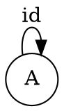
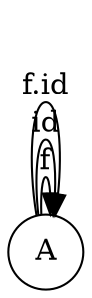
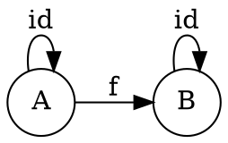
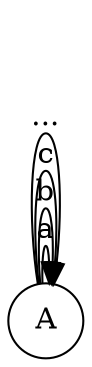
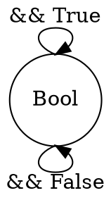

# Categories Great and Small
Chapter three of CTFP challenges.

## Generate a free category from:

> A graph with one node and no edges



> A graph with one node and one (directed) edge (hint: this edge can be composed with itself)

The edge can be composed infinitely with itself and id.



> A graph with two nodes and a single arrow between them



> A graph with a single node and 26 arrows marked with the letters of the alphabet: a, b, c … z.

This will explode pretty quickly, but there are 26 possible edges, however they can all be composed with identity and each other (since $a(A)->A$, $b(A)->A$, $a(b(A))->A$, etc.)




## What kind of order is this?

> A set of sets with the inclusion relation: 𝐴 is included in 𝐵 if every element of 𝐴 is also an element of 𝐵.
- Every set includes itself $A\subseteq A$, $B\subseteq B$ (identity?)
- If $A\subseteq B$ and $B\subseteq C$ then $A\subseteq C$ 

Partial order or a preorder.


> C++ types with the following subtyping relation: T1 is a subtype of T2 if a pointer to T1 can be passed to a function that expects a pointer to T2 without triggering a compilation error.

This sounds like classic inheritance based polymorphism:
```cpp

class ABC{
    public:
        virtual void do_stuff() {};
};

class Derived : public ABC {
    public:
        void do_stuff(){};
};

//!< we can pass a Derived pointer to this function
void some_function(ABC* ptr)();
```

In this case, it means that Derived contains ABC, which is to say: $ABC \subset Derived$. This is a pre-order because ABC and Derived are not equal, but ABC is a subset of Derived.


## Considering that Bool is a set of two values True and False, show that it forms two (set-theoretical) monoids with respect to, respectively, operator && (AND) and || (OR).

```
(a && b) && C == a && b && c
(a || b) || c == a || b || c

a && True = a (True if A is True, False if A is False)
a || False == a (True if A is True, False if A is False)

```


## Represent the Bool monoid with the AND operator as a category: List the morphisms and their rules of composition.



```
a && True = a -> id
id . id = id
id . (&& False) = (&& False)
(&& False) . (&& False) = (&& False)

```

## Represent addition modulo 3 as a monoid category.
Leaving this for now.